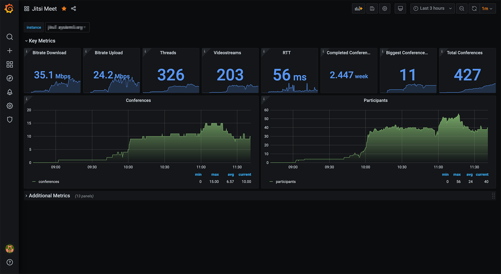

# Jitsi Meet Metrics Exporter

[](https://github.com/systemli/prometheus-jitsi-meet-exporter/workflows/Integration/badge.svg?branch=master) [](https://github.com/systemli/prometheus-jitsi-meet-exporter/workflows/Quality/badge.svg?branch=master) [](https://hub.docker.com/r/systemli/prometheus-jitsi-meet-exporter) [](https://hub.docker.com/r/systemli/prometheus-jitsi-meet-exporter)

Prometheus Exporter for Jitsi Meet written in Go. Based on [Jitsi Meet Exporter](https://git.autistici.org/ai3/tools/jitsi-prometheus-exporter) from [Autistici](https://www.autistici.org/)

There's multiple different [statistics endpoint that can be exposed by jitsi](https://github.com/jitsi/jitsi-videobridge/blob/master/doc/statistics.md) (like /stats and /colibri/stats); you can configure the used URL with the `videobridge-url`.
The exporter will handle both of them, but some metrics that aren't exposed may be reported as 0.

## Usage

```
go get github.com/systemli/prometheus-jitsi-meet-exporter
go install github.com/systemli/prometheus-jitsi-meet-exporter
$GOPATH/bin/prometheus-jitsi-meet-exporter
```

### Ansible

We also provide an [Ansible Role to install and configure the Jitsi Meet Exporter](https://github.com/systemli/ansible-role-jitsi-meet-exporter).

Example Playbook:

```yaml
- hosts: jitsimeetservers
  roles:
     - { role: systemli.jitsi_meet_exporter }
```

### Docker

```
docker run -p 9888:9888 systemli/prometheus-jitsi-meet-exporter:latest -videobridge-url http://jitsi:8888/stats 
```

## Dashboard

See the [Grafana Dashboards](dashboards) in this repository.

### Example



## Metrics

```
# HELP jitsi_threads The number of Java threads that the video bridge is using.
# TYPE jitsi_threads gauge
jitsi_threads 0
# HELP jitsi_bit_rate_download The total incoming bitrate for the video bridge in kilobits per second.
# TYPE jitsi_bit_rate_download gauge
jitsi_bit_rate_download 0
# HELP jitsi_bit_rate_upload The total outgoing bitrate for the video bridge in kilobits per second.
# TYPE jitsi_bit_rate_upload gauge
jitsi_bit_rate_upload 0
# HELP jitsi_packet_rate_download The total incoming packet rate for the video bridge in packets per second.
# TYPE jitsi_packet_rate_download gauge
jitsi_packet_rate_download 0
# HELP jitsi_packet_rate_upload The total outgoing packet rate for the video bridge in packets per second.
# TYPE jitsi_packet_rate_upload gauge
jitsi_packet_rate_upload 0
# HELP jitsi_loss_rate_download The fraction of lost incoming RTP packets. This is based on RTP sequence numbers and is relatively accurate.
# TYPE jitsi_loss_rate_download gauge
jitsi_loss_rate_download 0
# HELP jitsi_loss_rate_upload The fraction of lost outgoing RTP packets. This is based on incoming RTCP Receiver Reports, and an attempt to subtract the fraction of packets that were not sent (i.e. were lost before they reached the bridge). Further, this is averaged over all streams of all users as opposed to all packets, so it is not correctly weighted. This is not accurate, but may be a useful metric nonetheless.
# TYPE jitsi_loss_rate_upload gauge
jitsi_loss_rate_upload 0
# HELP jitsi_jitter_aggregate Experimental. An average value (in milliseconds) of the jitter calculated for incoming and outgoing streams. This hasn't been tested and it is currently not known whether the values are correct or not.
# TYPE jitsi_jitter_aggregate gauge
jitsi_jitter_aggregate 0
# HELP jitsi_rtt_aggregate An average value (in milliseconds) of the RTT across all streams.
# TYPE jitsi_rtt_aggregate gauge
jitsi_rtt_aggregate 0
# HELP jitsi_largest_conference The number of participants in the largest conference currently hosted on the bridge.
# TYPE jitsi_largest_conference gauge
jitsi_largest_conference 8
# HELP jitsi_audiochannels The current number of audio channels.
# TYPE jitsi_audiochannels gauge
jitsi_audiochannels 0
# HELP jitsi_videochannels The current number of video channels.
# TYPE jitsi_videochannels gauge
jitsi_videochannels 0
# HELP jitsi_conferences The current number of conferences.
# TYPE jitsi_conferences gauge
jitsi_conferences 0
# HELP jitsi_p2p_conferences The current number of p2p conferences.
# TYPE jitsi_p2p_conferences gauge
jitsi_p2p_conferences 1
# HELP jitsi_participants The current number of participants.
# TYPE jitsi_participants gauge
jitsi_participants 0
# HELP jitsi_videostreams An estimation of the number of current video streams forwarded by the bridge.
# TYPE jitsi_videostreams gauge
jitsi_videostreams 0
# HELP jitsi_total_loss_controlled_participant_seconds The total number of participant-seconds that are loss-controlled.
# TYPE jitsi_total_loss_controlled_participant_seconds counter
jitsi_total_loss_controlled_participant_seconds 0
# HELP jitsi_total_loss_limited_participant_seconds The total number of participant-seconds that are loss-limited.
# TYPE jitsi_total_loss_limited_participant_seconds counter
jitsi_total_loss_limited_participant_seconds 0
# HELP jitsi_total_loss_degraded_participant_seconds The total number of participant-seconds that are loss-degraded.
# TYPE jitsi_total_loss_degraded_participant_seconds counter
jitsi_total_loss_degraded_participant_seconds 0
# HELP jitsi_total_conference_seconds The sum of the lengths of all completed conferences, in seconds.
# TYPE jitsi_total_conference_seconds counter
jitsi_total_conference_seconds 0
# HELP jitsi_total_conferences_created The total number of conferences created on the bridge.
# TYPE jitsi_total_conferences_created counter
jitsi_total_conferences_created 0
# HELP jitsi_total_failed_conferences The total number of failed conferences on the bridge. A conference is marked as failed when all of its channels have failed. A channel is marked as failed if it had no payload activity.
# TYPE jitsi_total_failed_conferences counter
jitsi_total_failed_conferences 0
# HELP jitsi_total_partially_failed_conferences The total number of partially failed conferences on the bridge. A conference is marked as partially failed when some of its channels has failed. A channel is marked as failed if it had no payload activity.
# TYPE jitsi_total_partially_failed_conferences counter
jitsi_total_partially_failed_conferences 0
# HELP jitsi_total_data_channel_messages_received The total number messages received through data channels.
# TYPE jitsi_total_data_channel_messages_received counter
jitsi_total_data_channel_messages_received 0
# HELP jitsi_total_data_channel_messages_sent The total number messages sent through data channels.
# TYPE jitsi_total_data_channel_messages_sent counter
jitsi_total_data_channel_messages_sent 0
# HELP jitsi_total_colibri_web_socket_messages_received The total number messages received through COLIBRI web sockets.
# TYPE jitsi_total_colibri_web_socket_messages_received counter
jitsi_total_colibri_web_socket_messages_received 0
# HELP jitsi_total_colibri_web_socket_messages_sent The total number messages sent through COLIBRI web sockets.
# TYPE jitsi_total_colibri_web_socket_messages_sent counter
jitsi_total_colibri_web_socket_messages_sent 0
# HELP jitsi_octo_version The current running OCTO version
# TYPE jitsi_octo_version gauge
jitsi_octo_version 0
# HELP jitsi_octo_conferences The current number of OCTO conferences.
# TYPE jitsi_octo_conferences gauge
jitsi_octo_conferences 0
# HELP jitsi_octo_endpoints The current number of OCTO endpoints.
# TYPE jitsi_octo_endpoints gauge
jitsi_octo_endpoints 0
# HELP jitsi_octo_receive_bitrate The total receiving bitrate for the OCTO video bridge in kilobits per second.
# TYPE jitsi_octo_receive_bitrate gauge
jitsi_octo_receive_bitrate 0
# HELP jitsi_octo_send_bitrate The total outgoing bitrate for the OCTO video bridge in kilobits per second.
# TYPE jitsi_octo_send_bitrate gauge
jitsi_octo_send_bitrate 0
# HELP jitsi_octo_receive_packet_rate The total incoming packet rate for the OCTO video bridge in packets per second.
# TYPE jitsi_octo_receive_packet_rate gauge
jitsi_octo_receive_packet_rate 0
# HELP jitsi_octo_send_packet_rate The total outgoing packet rate for the OCTO video bridge in packets per second.
# TYPE jitsi_octo_send_packet_rate gauge
jitsi_octo_send_packet_rate 0
# HELP jitsi_total_bytes_received_octo The total incoming bit rate for the OCTO video bridge in bytes per second.
# TYPE jitsi_total_bytes_received_octo gauge
jitsi_total_bytes_received_octo 0
# HELP jitsi_total_bytes_sent_octo The total outgoing bit rate for the OCTO video bridge in bytes per second.
# TYPE jitsi_total_bytes_sent_octo gauge
jitsi_total_bytes_sent_octo 0
# HELP jitsi_total_packets_dropped_octo The total of dropped packets handled by the OCTO video bridge.
# TYPE jitsi_total_packets_dropped_octo gauge
jitsi_total_packets_dropped_octo 0
# HELP jitsi_total_packets_received_octo The total of incoming dropped packets handled by the OCTO video bridge.
# TYPE jitsi_total_packets_received_octo gauge
jitsi_total_packets_received_octo 0
# HELP jitsi_total_packets_sent_octo The total of sent dropped packets handled by the OCTO video bridge.
# TYPE jitsi_total_packets_sent_octo gauge
jitsi_total_packets_sent_octo 0
```

## License

GPLv3
