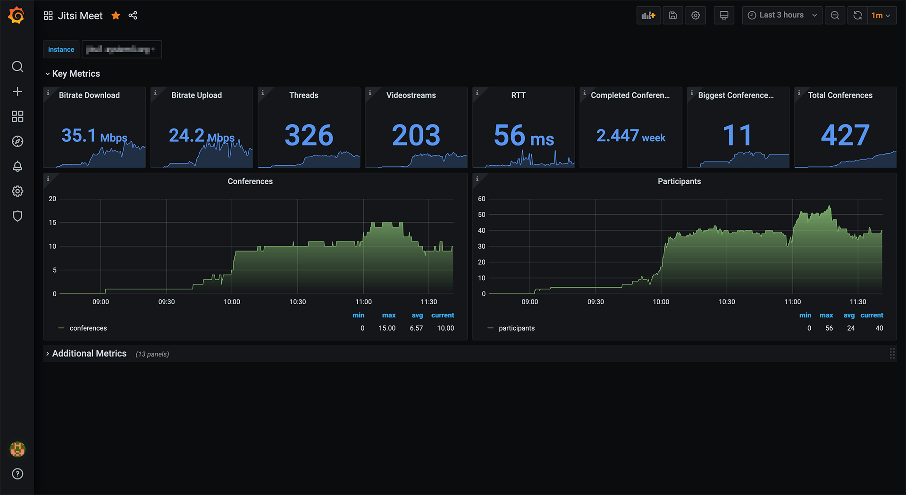

# Jitsi Meet Metrics Exporter

[](https://github.com/systemli/prometheus-jitsi-meet-exporter/workflows/Integration/badge.svg?branch=main) [](https://github.com/systemli/prometheus-jitsi-meet-exporter/workflows/Quality/badge.svg?branch=main) [](https://hub.docker.com/r/systemli/prometheus-jitsi-meet-exporter) [](https://hub.docker.com/r/systemli/prometheus-jitsi-meet-exporter)

Prometheus Exporter for Jitsi Meet written in Go. Based on [Jitsi Meet Exporter](https://git.autistici.org/ai3/tools/jitsi-prometheus-exporter) from [Autistici](https://www.autistici.org/)

There's multiple different [statistics endpoint that can be exposed by jitsi](https://github.com/jitsi/jitsi-videobridge/blob/master/doc/statistics.md) (like /stats and /colibri/stats); you can configure the used URL with the `videobridge-url`.
The exporter will handle both of them, but some metrics that aren't exposed may be reported as 0.

## Usage

```
go install github.com/systemli/prometheus-jitsi-meet-exporter@latest
$GOPATH/bin/prometheus-jitsi-meet-exporter
```

### Ansible

We also provide an [Ansible Role to install and configure the Jitsi Meet Exporter](https://github.com/systemli/ansible-role-jitsi-meet-exporter).

Example Playbook:

```yaml
- hosts: jitsimeetservers
  roles:
     - { role: systemli.jitsi_meet_exporter }
```

### Docker

```
docker run -p 9888:9888 systemli/prometheus-jitsi-meet-exporter:latest -videobridge-url http://jitsi:8080/colibri/stats
```

## Dashboard

See the [Grafana Dashboards](dashboards) in this repository.

### Example



## Metrics

```
# HELP jitsi_threads The number of Java threads that the video bridge is using.
# TYPE jitsi_threads gauge
jitsi_threads 0
# HELP jitsi_bit_rate_download The total incoming bitrate for the video bridge in kilobits per second.
# TYPE jitsi_bit_rate_download gauge
jitsi_bit_rate_download 0
# HELP jitsi_bit_rate_upload The total outgoing bitrate for the video bridge in kilobits per second.
# TYPE jitsi_bit_rate_upload gauge
jitsi_bit_rate_upload 0
# HELP jitsi_packet_rate_download The total incoming packet rate for the video bridge in packets per second.
# TYPE jitsi_packet_rate_download gauge
jitsi_packet_rate_download 0
# HELP jitsi_packet_rate_upload The total outgoing packet rate for the video bridge in packets per second.
# TYPE jitsi_packet_rate_upload gauge
jitsi_packet_rate_upload 0
# HELP jitsi_loss_rate_download The fraction of lost incoming RTP packets. This is based on RTP sequence numbers and is relatively accurate.
# TYPE jitsi_loss_rate_download gauge
jitsi_loss_rate_download 0
# HELP jitsi_loss_rate_upload The fraction of lost outgoing RTP packets. This is based on incoming RTCP Receiver Reports, and an attempt to subtract the fraction of packets that were not sent (i.e. were lost before they reached the bridge). Further, this is averaged over all streams of all users as opposed to all packets, so it is not correctly weighted. This is not accurate, but may be a useful metric nonetheless.
# TYPE jitsi_loss_rate_upload gauge
jitsi_loss_rate_upload 0
# HELP jitsi_jitter_aggregate Experimental. An average value (in milliseconds) of the jitter calculated for incoming and outgoing streams. This hasn't been tested and it is currently not known whether the values are correct or not.
# TYPE jitsi_jitter_aggregate gauge
jitsi_jitter_aggregate 0
# HELP jitsi_rtt_aggregate An average value (in milliseconds) of the RTT across all streams.
# TYPE jitsi_rtt_aggregate gauge
jitsi_rtt_aggregate 0
# HELP jitsi_largest_conference The number of participants in the largest conference currently hosted on the bridge.
# TYPE jitsi_largest_conference gauge
jitsi_largest_conference 0
# HELP jitsi_audiochannels The current number of audio channels.
# TYPE jitsi_audiochannels gauge
jitsi_audiochannels 0
# HELP jitsi_videochannels The current number of video channels.
# TYPE jitsi_videochannels gauge
jitsi_videochannels 0
# HELP jitsi_conferences The current number of conferences.
# TYPE jitsi_conferences gauge
jitsi_conferences 0
# HELP jitsi_p2p_conferences The current number of p2p conferences.
# TYPE jitsi_p2p_conferences gauge
jitsi_p2p_conferences 0
# HELP jitsi_participants The current number of participants.
# TYPE jitsi_participants gauge
jitsi_participants 0
# HELP jitsi_total_participants Total participants since running.
# TYPE jitsi_total_participants gauge
jitsi_total_participants 0
# HELP jitsi_endpoint_sending_video An estimation of the number of current endpoints sending a video stream.
# TYPE jitsi_endpoint_sending_video gauge
jitsi_endpoints_sending_video 0
# HELP jitsi_videostreams An estimation of the number of current video streams forwarded by the bridge.
# TYPE jitsi_videostreams gauge
jitsi_videostreams 0
# HELP jitsi_stress_level Stress Level reported to Jicofo by the videobridge.
# TYPE jitsi_stress_level gauge
jitsi_stress_level 0
# HELP jitsi_total_loss_controlled_participant_seconds The total number of participant-seconds that are loss-controlled.
# TYPE jitsi_total_loss_controlled_participant_seconds counter
jitsi_total_loss_controlled_participant_seconds 0
# HELP jitsi_total_loss_limited_participant_seconds The total number of participant-seconds that are loss-limited.
# TYPE jitsi_total_loss_limited_participant_seconds counter
jitsi_total_loss_limited_participant_seconds 0
# HELP jitsi_total_loss_degraded_participant_seconds The total number of participant-seconds that are loss-degraded.
# TYPE jitsi_total_loss_degraded_participant_seconds counter
jitsi_total_loss_degraded_participant_seconds 0
# HELP jitsi_total_conference_seconds The sum of the lengths of all completed conferences, in seconds.
# TYPE jitsi_total_conference_seconds counter
jitsi_total_conference_seconds 0
# HELP jitsi_total_conferences_created The total number of conferences created on the bridge.
# TYPE jitsi_total_conferences_created counter
jitsi_total_conferences_created 0
# HELP jitsi_total_conferences_completed The total number of conferences completed on the bridge.
# TYPE jitsi_total_conferences_completed counter
jitsi_total_conferences_completed 0
# HELP jitsi_total_failed_conferences The total number of failed conferences on the bridge. A conference is marked as failed when all of its channels have failed. A channel is marked as failed if it had no payload activity.
# TYPE jitsi_total_failed_conferences counter
jitsi_total_failed_conferences 0
# HELP jitsi_total_partially_failed_conferences The total number of partially failed conferences on the bridge. A conference is marked as partially failed when some of its channels has failed. A channel is marked as failed if it had no payload activity.
# TYPE jitsi_total_partially_failed_conferences counter
jitsi_total_partially_failed_conferences 0
# HELP jitsi_total_data_channel_messages_received The total number messages received through data channels.
# TYPE jitsi_total_data_channel_messages_received counter
jitsi_total_data_channel_messages_received 0
# HELP jitsi_total_data_channel_messages_sent The total number messages sent through data channels.
# TYPE jitsi_total_data_channel_messages_sent counter
jitsi_total_data_channel_messages_sent 0
# HELP jitsi_total_colibri_web_socket_messages_received The total number messages received through COLIBRI web sockets.
# TYPE jitsi_total_colibri_web_socket_messages_received counter
jitsi_total_colibri_web_socket_messages_received 0
# HELP jitsi_total_colibri_web_socket_messages_sent The total number messages sent through COLIBRI web sockets.
# TYPE jitsi_total_colibri_web_socket_messages_sent counter
jitsi_total_colibri_web_socket_messages_sent 0
# HELP jitsi_octo_version The current running OCTO version
# TYPE jitsi_octo_version gauge
jitsi_octo_version 0
# HELP jitsi_octo_conferences The current number of OCTO conferences.
# TYPE jitsi_octo_conferences gauge
jitsi_octo_conferences 0
# HELP jitsi_octo_endpoints The current number of OCTO endpoints.
# TYPE jitsi_octo_endpoints gauge
jitsi_octo_endpoints 0
# HELP jitsi_octo_receive_bitrate The total receiving bitrate for the OCTO video bridge in kilobits per second.
# TYPE jitsi_octo_receive_bitrate gauge
jitsi_octo_receive_bitrate 0
# HELP jitsi_octo_send_bitrate The total outgoing bitrate for the OCTO video bridge in kilobits per second.
# TYPE jitsi_octo_send_bitrate gauge
jitsi_octo_send_bitrate 0
# HELP jitsi_octo_receive_packet_rate The total incoming packet rate for the OCTO video bridge in packets per second.
# TYPE jitsi_octo_receive_packet_rate gauge
jitsi_octo_receive_packet_rate 0
# HELP jitsi_octo_send_packet_rate The total outgoing packet rate for the OCTO video bridge in packets per second.
# TYPE jitsi_octo_send_packet_rate gauge
jitsi_octo_send_packet_rate 0
# HELP jitsi_total_bytes_received_octo The total incoming bit rate for the OCTO video bridge in bytes per second.
# TYPE jitsi_total_bytes_received_octo gauge
jitsi_total_bytes_received_octo 0
# HELP jitsi_total_bytes_sent_octo The total outgoing bit rate for the OCTO video bridge in bytes per second.
# TYPE jitsi_total_bytes_sent_octo gauge
jitsi_total_bytes_sent_octo 0
# HELP jitsi_total_packets_dropped_octo The total of dropped packets handled by the OCTO video bridge.
# TYPE jitsi_total_packets_dropped_octo gauge
jitsi_total_packets_dropped_octo 0
# HELP jitsi_total_packets_received_octo The total of incoming dropped packets handled by the OCTO video bridge.
# TYPE jitsi_total_packets_received_octo gauge
jitsi_total_packets_received_octo 0
# HELP jitsi_total_packets_sent_octo The total of sent dropped packets handled by the OCTO video bridge.
# TYPE jitsi_total_packets_sent_octo gauge
jitsi_total_packets_sent_octo 0
# HELP total_ice_succeeded_relayed The total number of times an ICE Agent succeeded and the selected candidate pair included a relayed candidate.
# TYPE total_ice_succeeded_relayed gauge
total_ice_succeeded_relayed 0
# HELP total_ice_succeeded The total number of times an ICE Agent succeeded.
# TYPE total_ice_succeeded gauge
total_ice_succeeded 0
# HELP total_ice_succeeded_tcp The total number of times an ICE Agent succeeded and the selected candidate was a TCP candidate.
# TYPE total_ice_succeeded_tcp gauge
total_ice_succeeded_tcp 0
# HELP total_ice_failed The total number of times an ICE Agent failed to establish connectivity.
# TYPE total_ice_failed gauge
total_ice_failed 0
# HELP jitsi_endpoints_with_suspended_sources Number of endpoints that we have suspended sending some video streams to because of bwe.
# TYPE jitsi_endpoints_with_suspended_sources gauge
jitsi_endpoints_with_suspended_sources 0
# HELP jitsi_inactive_endpoints Number of endpoints in inactive conferences (where no endpoint sends audio or video).
# TYPE jitsi_inactive_endpoints gauge
jitsi_inactive_endpoints 0
# HELP jitsi_inactive_conferences Number of inactive conferences (no endpoint is sending audio or video).
# TYPE jitsi_inactive_conferences gauge
jitsi_inactive_conferences 0
# HELP jitsi_local_active_endpoints The number of active local endpoints (in a conference where at least one endpoint sends audio or video).
# TYPE jitsi_local_active_endpoints gauge
jitsi_local_active_endpoints 0
# HELP jitsi_muc_clients_connected The current number of connected XMPP MUC clients.
# TYPE jitsi_muc_clients_connected gauge
jitsi_muc_clients_connected 0
# HELP jitsi_local_endpoints The current number of local non-OCTO endpoints.
# TYPE jitsi_local_endpoints gauge
jitsi_local_endpoints 0
# HELP jitsi_total_packets_received The total number of RTP packets received.
# TYPE jitsi_total_packets_received gauge
jitsi_total_packets_received 0
# HELP jitsi_preemptive_kfr_suppressed Number of preemptive keyframe requests that were not sent because no endpoints were in stage view.
# TYPE jitsi_preemptive_kfr_suppressed gauge
jitsi_preemptive_kfr_suppressed 0
# HELP jitsi_preemptive_kfr_sent Number of preemptive keyframe requests that were sent.
# TYPE jitsi_preemptive_kfr_sent gauge
jitsi_preemptive_kfr_sent 0
# HELP jitsi_total_keyframes_received Number of keyframes that were received (updated on endpoint expiration).
# TYPE jitsi_total_keyframes_received gauge
jitsi_total_keyframes_received 0
# HELP jitsi_total_dominant_speaker_changes The total number of dominant speaker changes.
# TYPE jitsi_total_dominant_speaker_changes gauge
jitsi_total_dominant_speaker_changes 0
# HELP jitsi_endpoints_with_spurious_remb Number of endpoints that have sent a REMB packet even though REMB was not configured.
# TYPE jitsi_endpoints_with_spurious_remb gauge
jitsi_endpoints_with_spurious_remb 0
# HELP jitsi_receive_only_endpoints Number of endpoints that are not sending audio or video (but are receiving).
# TYPE jitsi_receive_only_endpoints gauge
jitsi_receive_only_endpoints 0
# HELP jitsi_total_visitors The total number of visitors since startup.
# TYPE jitsi_total_visitors gauge
jitsi_total_visitors 0
# HELP jitsi_visitors The total number of visitor endpoints created.
# TYPE jitsi_visitors gauge
jitsi_visitors 0
# HELP jitsi_num_eps_oversending Number of endpoints that we are oversending to.
# TYPE jitsi_num_eps_oversending gauge
jitsi_num_eps_oversending 0
# HELP jitsi_num_eps_no_msg_transport_after_delay Number of endpoints which had not established a relay message transport even after some delay.
# TYPE jitsi_num_eps_no_msg_transport_after_delay gauge
jitsi_num_eps_no_msg_transport_after_delay 0
# HELP jitsi_muc_clients_configured The number of configured XMPP MUC clients.
# TYPE jitsi_muc_clients_configured gauge
jitsi_muc_clients_configured 0
# HELP jitsi_outgoing_loss Fraction of outgoing RTP packets that are lost.
# TYPE jitsi_outgoing_loss gauge
jitsi_outgoing_loss 0
# HELP jitsi_overall_loss Fraction of RTP packets that are lost (incoming and outgoing combined).
# TYPE jitsi_overall_loss gauge
jitsi_overall_loss 0
# HELP jitsi_total_layering_changes_received Number of times the layering of an incoming video stream changed (updated on endpoint expiration).
# TYPE jitsi_total_layering_changes_received gauge
jitsi_total_layering_changes_received 0
# HELP jitsi_total_relays The total number of relays created.
# TYPE jitsi_total_relays gauge
jitsi_total_relays 0
# HELP jitsi_endpoints_with_high_outgoing_loss Number of endpoints that have high outgoing loss (>10%).
# TYPE jitsi_endpoints_with_high_outgoing_loss gauge
jitsi_endpoints_with_high_outgoing_loss 0
# HELP jitsi_drain Whether the bridge is draining and should avoid new conference allocation.
# TYPE jitsi_drain gauge
jitsi_drain 0
# HELP jitsi_total_video_stream_milliseconds_received Total duration of video received, in milliseconds (each SSRC counts separately).
# TYPE jitsi_total_video_stream_milliseconds_received gauge
jitsi_total_video_stream_milliseconds_received 0
# HELP jitsi_shutting_down Whether jitsi-videobridge is shutting down.
# TYPE jitsi_shutting_down gauge
jitsi_shutting_down 0
# HELP jitsi_num_relays_no_msg_transport_after_delay Number of relays which had not established a relay message transport even after some delay.
# TYPE jitsi_num_relays_no_msg_transport_after_delay gauge
jitsi_num_relays_no_msg_transport_after_delay 0
# HELP jitsi_average_participant_stress Average participant stress reported by the bridge.
# TYPE jitsi_average_participant_stress gauge
jitsi_average_participant_stress 0.00
# HELP jitsi_total_packets_sent The total number of RTP packets sent.
# TYPE jitsi_total_packets_sent gauge
jitsi_total_packets_sent 0
# HELP jitsi_endpoints Number of current endpoints (local and relayed).
# TYPE jitsi_endpoints gauge
jitsi_endpoints 0
# HELP jitsi_incoming_loss Fraction of incoming RTP packets that are lost.
# TYPE jitsi_incoming_loss gauge
jitsi_incoming_loss 0
# HELP jitsi_endpoints_reconnected Endpoints reconnected after being detected as temporarily inactive/disconnected due to inactivity.
# TYPE jitsi_endpoints_reconnected gauge
jitsi_endpoints_reconnected 0
# HELP jitsi_graceful_shutdown Whether jitsi-videobridge is in graceful shutdown mode.
# TYPE jitsi_graceful_shutdown gauge
jitsi_graceful_shutdown 0
# HELP jitsi_total_bytes_received The total number of RTP bytes received.
# TYPE jitsi_total_bytes_received gauge
jitsi_total_bytes_received 0
# HELP jitsi_endpoints_disconnected Endpoints detected as temporarily inactive/disconnected due to inactivity.
# TYPE jitsi_endpoints_disconnected gauge
jitsi_endpoints_disconnected 0
# HELP jitsi_endpoints_sending_audio The number of local endpoints sending audio.
# TYPE jitsi_endpoints_sending_audio gauge
jitsi_endpoints_sending_audio 0
# HELP jitsi_dtls_failed_endpoints The total number of endpoints that failed to establish DTLS.
# TYPE jitsi_dtls_failed_endpoints gauge
jitsi_dtls_failed_endpoints 0
# HELP jitsi_total_bytes_sent The total number of RTP bytes sent.
# TYPE jitsi_total_bytes_sent gauge
jitsi_total_bytes_sent 0
# HELP jitsi_healthy Whether this bridge currently reports itself as healthy.
# TYPE jitsi_healthy gauge
jitsi_healthy 1
# HELP jitsi_mucs_configured The number of configured MUCs.
# TYPE jitsi_mucs_configured gauge
jitsi_mucs_configured 0
# HELP jitsi_mucs_joined The number of joined MUCs.
# TYPE jitsi_mucs_joined gauge
jitsi_mucs_joined 0
# HELP jitsi_version_info Jitsi Videobridge version information.
# TYPE jitsi_version_info gauge
jitsi_version_info{version="2.3"} 1
# HELP jitsi_region_info Configured bridge region information.
# TYPE jitsi_region_info gauge
jitsi_region_info{region="all"} 1
# HELP jitsi_relay_id_info Relay identifier information.
# TYPE jitsi_relay_id_info gauge
jitsi_relay_id_info{relay_id="jitsi-jvb-0"} 1
# HELP jitsi_conference_sizes Distribution of conference sizes
# TYPE jitsi_conference_sizes gauge
```

## License

GPLv3
